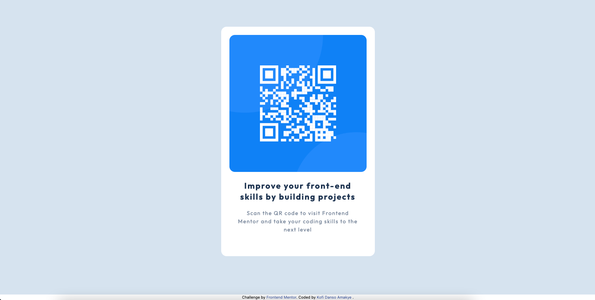

# Frontend Mentor - QR code component solution

This is a solution to the [QR code component challenge on Frontend Mentor](https://www.frontendmentor.io/challenges/qr-code-component-iux_sIO_H). Frontend Mentor challenges help you improve your coding skills by building realistic projects. 

## Table of contents

- [Overview](#overview)
  - [Screenshot](#screenshot)
  - [Links](#links)
- [My process](#my-process)
  - [Built with](#built-with)
- [Author](#author)
- [Acknowledgments](#acknowledgments)


## Overview

### Screenshot




### Links

- Solution URL: [Add solution URL here](https://your-solution-url.com)
- Live Site URL: [Add live site URL here](https://your-live-site-url.com)

## My process

### Built with

- TailwindCss 


### What I learned

This is the beginning of using tailwindcss to build responsive pages using flexbox and media queries.The flexbox aprroach of doing things is a little bit different from grids but i want to use flexbox inorder to create vibrant and efficient responsive websites.I was able to identify how flex  , max-width and justify-content go hand in hand when it comes to alignment.Code Snippet that was helpful:

```html 
 <div class="flex flex-col bg-LightGray justify-center h-screen md:flex-row md:p-20 ">
    <!--Card-->
    <div class="mx-10 bg-white rounded-2xl md:m-8">
      <!--Flex Container-->
      <div class="flex flex-col p-6 items-center md:max-w-md ">
```
## Author

- Frontend Mentor - [@Kofiastro](https://www.frontendmentor.io/profile/kofiastro)
## Acknowledgments
Big thanks to Trsavery Media and frontendmentor 🎉
